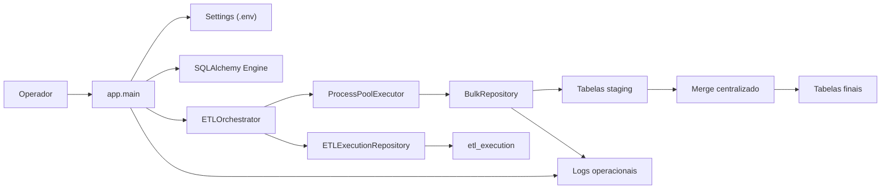
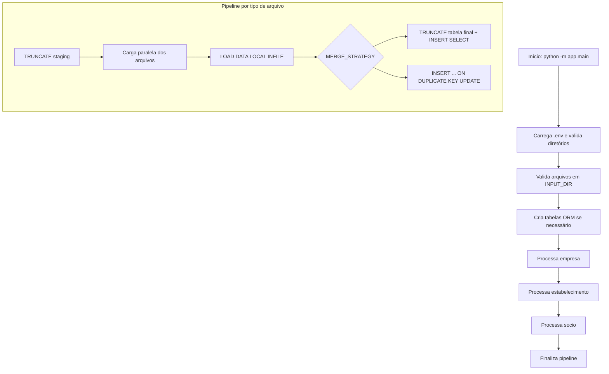
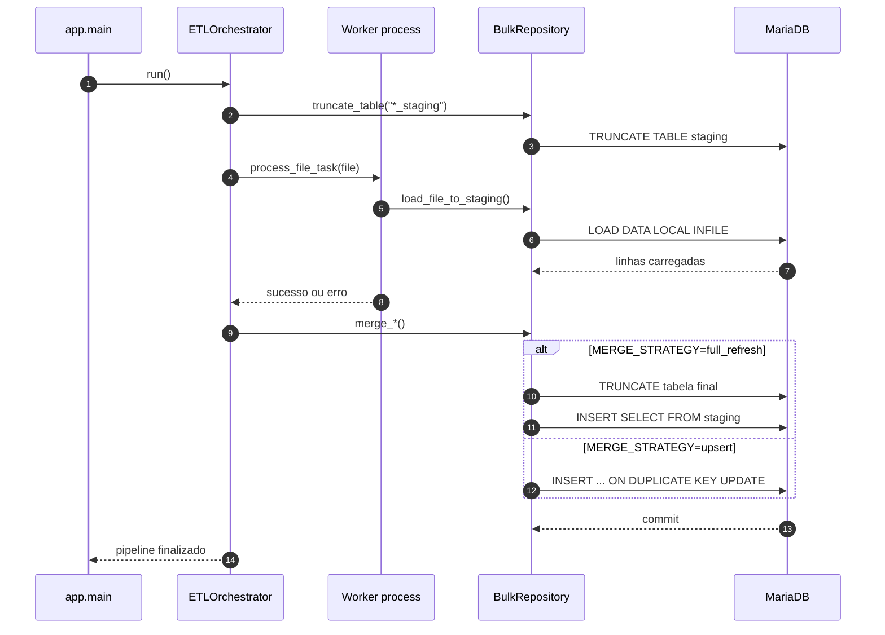
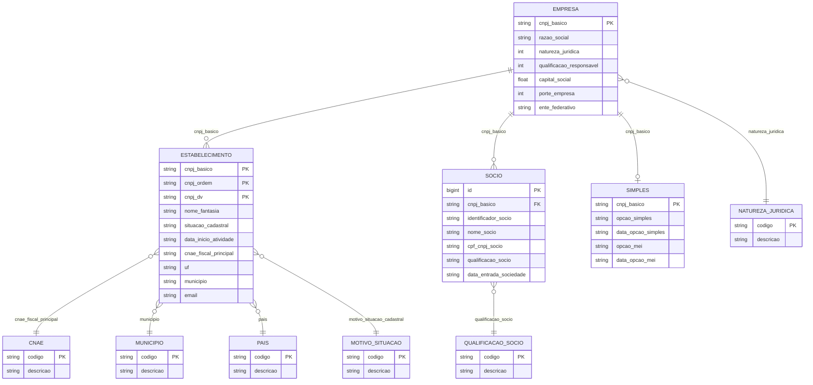
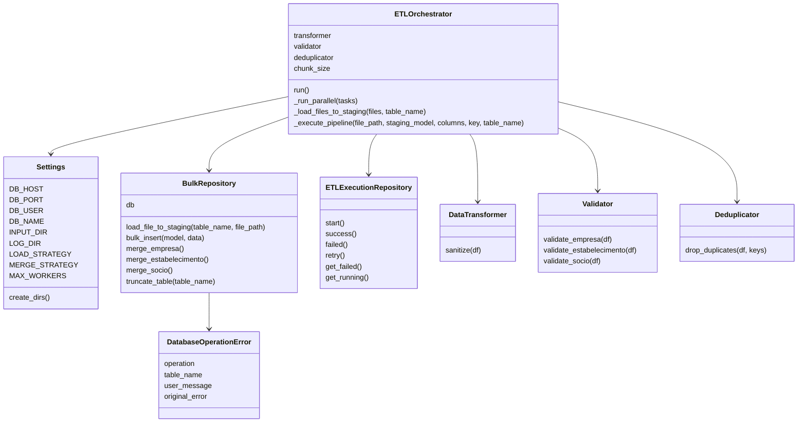

# Documentacao Tecnica - RFB Loader Enterprise

## Estado Atual da v3

A v3 implementa um fluxo em tres bancos:

```text
rfb_import    -> carga bruta dos arquivos CSV da RFB
dados_rfb     -> base final promovida/consultavel
dados_rfb_ops -> metadados operacionais do ETL
```

### Carga Bruta

O modo recomendado para carga completa e:

```env
SYNC_STRATEGY=raw_import
LOAD_TARGET=final
LOAD_STRATEGY=load_data
RAW_IMPORT_FAST_SCHEMA=True
RAW_IMPORT_RESET_TABLES=True
```

Com `RAW_IMPORT_FAST_SCHEMA=True`, as tabelas do banco `rfb_import` sao criadas sem indices e sem primary keys para maximizar throughput de `LOAD DATA LOCAL INFILE`.

### Manifesto de Arquivos RFB

O arquivo `app/etl/rfb_manifest.py` centraliza o mapeamento entre arquivos, tabelas, colunas e chaves de comparacao.

| Tabela | Padroes de arquivo | Chave de comparacao |
| --- | --- | --- |
| `empresa` | `*.EMPRECSV` | `cnpj_basico` |
| `estabelecimento` | `*.ESTABELE` | `cnpj_basico`, `cnpj_ordem`, `cnpj_dv` |
| `socio` | `*.SOCIOCSV` | `cnpj_basico`, `identificador_socio`, `nome_socio`, `cpf_cnpj_socio`, `data_entrada_sociedade` |
| `simples` | `*.SIMPLES.CSV.*` | `cnpj_basico` |
| `cnae` | `*.CNAECSV` | `codigo` |
| `moti` | `*.MOTICSV` | `codigo` |
| `munic` | `*.MUNICCSV` | `codigo` |
| `natju` | `*.NATJUCSV` | `codigo` |
| `pais` | `*.PAISCSV` | `codigo` |
| `quals` | `*.QUALSCSV` | `codigo` |

### Promocao Para Banco Final

Ao final da carga bruta, se `PROMOTE_RAW_IMPORT_AFTER_LOAD=True`, o `RawImportPromotionRepository` promove `rfb_import` para `dados_rfb`.

Estrategia padrao:

```env
DB_PROMOTION_STRATEGY=rename_swap
```

Com `rename_swap`, o ETL move as tabelas carregadas em `rfb_import` para `dados_rfb` com `RENAME TABLE`.
Essa operacao evita `INSERT INTO ... SELECT` em tabelas gigantes e deve reduzir em pelo menos 80% o tempo de promocao.
Ao final de cada tabela promovida, a tabela bruta correspondente e recriada vazia em `rfb_import` para a proxima execucao.

Regras da estrategia `rename_swap`:

- valida que as tabelas com arquivos encontrados possuem registros em `rfb_import`;
- se a tabela ainda nao existe em `dados_rfb`, move a tabela nova sem comparacao/auditoria linha-a-linha;
- se a tabela ja existe em `dados_rfb`, audita campos monitorados antes de mover a tabela;
- move cada tabela de `rfb_import` para `dados_rfb`;
- se a tabela final ja existir, troca a tabela final por uma tabela nova carregada;
- registra a promocao em `dados_rfb.controle_alteracao`;
- registra tempo por tabela e tempo total de promocao.

A estrategia antiga continua disponivel com:

```env
DB_PROMOTION_STRATEGY=copy
```

Regras da estrategia `copy`:

- se `dados_rfb` nao existir, cria e copia todas as tabelas;
- se `dados_rfb` existir, copia sem comparacao as tabelas finais inexistentes;
- se a tabela ja existir em `dados_rfb`, compara contagem e checksum por tabela;
- registra o resultado em `dados_rfb.controle_alteracao`;
- substitui a tabela final quando houver divergencia.

A tabela `controle_alteracao` contem:

```text
id
tabela
status
alteracao
data_movimento
hora_movimento
created_at
```

Status esperados:

```text
sem alteracao
tem alteracao
copiada
```

Por performance, `CONTROL_DIFF_DETAIL_TABLES` limita quais tabelas recebem detalhe campo-a-campo. O padrao e:

```env
CONTROL_DIFF_DETAIL_TABLES=cnae,moti,munic,natju,pais,quals
CONTROL_DIFF_MAX_ROWS=1000
```

### Auditoria Seletiva De Campos

Para manter historico de mudancas importantes sem comparar todos os campos das tabelas grandes, o ETL usa auditoria seletiva.

Tabelas envolvidas:

```text
controle_campo_monitorado  -> configuracao administrada no banco
estado_campo_monitorado    -> ultimo valor conhecido por chave/campo
historico_campo_monitorado -> alteracoes detectadas por execucao mensal
```

Fluxo:

1. O administrador cadastra em `controle_campo_monitorado` os campos que devem ser auditados.
2. Antes do `rename_swap`, o ETL compara o novo `rfb_import` com `estado_campo_monitorado`.
3. Quando o valor muda, grava uma linha em `historico_campo_monitorado`.
4. Depois atualiza `estado_campo_monitorado` com os valores do arquivo novo.
5. Em seguida executa o `rename_swap`.

Campo padrao criado na primeira execucao:

```text
estabelecimento.situacao_cadastral
```

Esse campo permite consultar quando um estabelecimento mudou de situacao, por exemplo de ativo para inativo e depois para ativo novamente.

Exemplo de inclusao de campo monitorado pelo administrador:

```sql
INSERT INTO dados_rfb.controle_campo_monitorado (tabela, campo, ativo, observacao)
VALUES ('estabelecimento', 'motivo_situacao_cadastral', 1, 'Auditar motivo de alteracao cadastral')
ON DUPLICATE KEY UPDATE ativo = VALUES(ativo), observacao = VALUES(observacao);
```

Recomendacao de permissao:

```sql
REVOKE INSERT, UPDATE, DELETE ON dados_rfb.controle_campo_monitorado FROM 'usuario_app'@'%';
GRANT SELECT ON dados_rfb.controle_campo_monitorado TO 'usuario_app'@'%';
```

O usuario operacional da aplicacao precisa criar as tabelas na primeira execucao. Em ambiente controlado, apos a criacao inicial, a alteracao da configuracao deve ficar restrita ao administrador.
Depois de cadastrar os campos definitivos e restringir permissao de escrita, use `MONITORED_FIELDS_BOOTSTRAP_DEFAULTS=False` para evitar tentativas de bootstrap pelo ETL.

### Banco Operacional

O banco `dados_rfb_ops` guarda status, progresso, checkpoint e metricas:

```text
etl_execution
etl_run
etl_run_phase
etl_file_progress
etl_metric
etl_checkpoint
etl_dead_letter
data_quality_rule
```

Essas tabelas nao devem ficar no `rfb_import`, porque ele deve permanecer dedicado a carga bruta dos arquivos da Receita.

### Requisitos De Performance E Documentacao

- A promocao `rfb_import -> dados_rfb` deve evitar copia linha-a-linha quando `DB_PROMOTION_STRATEGY=rename_swap`.
- A meta minima e reduzir em pelo menos 80% o tempo de promocao em relacao ao modo `copy`.
- O log deve mostrar tempo por tabela na carga, tempo por tabela na promocao, tempo total de carga, tempo total de promocao e tempo total do pipeline.
- Toda nova versao ou branch com alteracao funcional deve atualizar `README.md`, `docs/APPLICATION_DOCUMENTATION.md` e, quando aplicavel, `docs/REQUIREMENTS.md`.

Ver tambem: [Requisitos](REQUIREMENTS.md).

---

# Documentação Técnica - RFB Loader Enterprise

## 1. Visão Geral

O RFB Loader Enterprise é uma aplicação Python para carga dos dados públicos de CNPJ da Receita Federal do Brasil em banco relacional MariaDB.

Esta versão usa MariaDB como SGBD alvo e DBeaver 26.1.0 como cliente SQL recomendado para administração, inspeção dos dados e acompanhamento operacional. A aplicação acessa o MariaDB pelo driver SQLAlchemy `mysql+pymysql`, mantendo compatibilidade com o protocolo MySQL usado pelo MariaDB.

O pipeline atual usa uma arquitetura em camadas:

- `app.main`: inicialização, validação de ambiente e execução do ETL.
- `app.config`: leitura de variáveis de ambiente e parâmetros operacionais.
- `app.database`: engine SQLAlchemy e fábrica de sessões.
- `app.models`: modelos ORM das tabelas finais, staging e controle de execução.
- `app.etl.orchestrator`: coordenação do pipeline, paralelismo e ordem de processamento.
- `app.etl.bulk_repository`: operações de carga massiva, staging, merge e truncamento.
- `app.etl.validator`, `transformer`, `deduplicator`: tratamento e validação usados no modo pandas.
- `app.etl.etl_execution_repository`: auditoria de execução por arquivo.

O objetivo operacional é reduzir a carga completa da base RFB usando `LOAD DATA LOCAL INFILE`, staging tables e merge centralizado.

## 2. Execução

Com o ambiente virtual ativo, execute a partir da raiz do repositório:

```bash
python -m app.main
```

Configuração recomendada para carga completa:

```env
APP_VERSION=V3.1.0
LOAD_STRATEGY=load_data
MERGE_STRATEGY=full_refresh
DB_LOCAL_INFILE=True
MAX_WORKERS=4
```

`APP_VERSION` deve ser mantida no `.env` pelo analista responsavel pela implantacao.
Na inicializacao, o valor e registrado no cabecalho do log junto com o nome da aplicacao.

Para reduzir carga no MariaDB em janelas de importacao grandes, `MONITORED_FIELD_AUDIT_ENABLED=False`
desliga temporariamente a auditoria dos campos configurados em `controle_campo_monitorado`.
Use essa opcao quando a prioridade for concluir a carga/promocao e o historico detalhado
puder ser processado em outro momento.

Para o `LOAD DATA LOCAL INFILE` funcionar, o MariaDB precisa estar com `local_infile` habilitado no cliente e no servidor:

```sql
SHOW GLOBAL VARIABLES LIKE 'local_infile';
SET GLOBAL local_infile = 1;
```

## 3. Arquitetura



Arquivo separado: [architecture.mmd](diagrams/architecture.mmd)

## 4. Fluxo ETL



Arquivo separado: [etl-flow.mmd](diagrams/etl-flow.mmd)

## 5. Sequência de Carga



Arquivo separado: [sequence-load.mmd](diagrams/sequence-load.mmd)

## 6. Modelo Entidade-Relacionamento

As principais chaves de ligação da base são:

- `empresa.cnpj_basico`
- `estabelecimento.cnpj_basico`
- `socio.cnpj_basico`
- `simples.cnpj_basico`



Arquivo separado: [erd.mmd](diagrams/erd.mmd)

## 7. Diagrama de Classes



Arquivo separado: [class-diagram.mmd](diagrams/class-diagram.mmd)

## 8. Componentes de Banco

### Tabelas staging

As tabelas staging recebem os dados brutos já normalizados minimamente pelo `LOAD DATA`:

- `empresa_staging`
- `estabelecimento_staging`
- `socio_staging`

Elas são truncadas antes de cada carga do respectivo tipo.

### Tabelas finais

As tabelas finais são otimizadas para consulta e relacionamento:

- `empresa`
- `estabelecimento`
- `socio`
- `simples`
- tabelas auxiliares: `cnae`, `municipio`, `pais`, `natureza_juridica`, `qualificacao_socio`, `motivo_situacao`

### Controle de execução

A tabela `etl_execution` registra:

- arquivo processado;
- tabela alvo;
- status (`STARTED`, `SUCCESS`, `FAILED`, `RETRY`);
- quantidade de registros;
- duração;
- worker;
- mensagem de erro.

## 9. Estratégias de Carga

### `LOAD_STRATEGY=load_data`

Estratégia recomendada para grandes volumes. Usa `LOAD DATA LOCAL INFILE` para inserir arquivos diretamente nas tabelas staging.

Requisitos:

- `DB_LOCAL_INFILE=True` no `.env`;
- `local_infile=ON` no MariaDB;
- permissão do usuário de banco para carga local;
- arquivos acessíveis pelo processo Python.

### `LOAD_STRATEGY=pandas`

Estratégia de fallback. Lê arquivos em chunks com pandas e insere em lotes via SQLAlchemy. É mais lenta, mas pode ser útil quando `LOAD DATA LOCAL INFILE` não está disponível.

### `MERGE_STRATEGY=full_refresh`

Estratégia recomendada para reconstrução completa da base. Faz:

1. `TRUNCATE` da tabela final.
2. `INSERT SELECT` da staging para a tabela final.

Vantagem: reduz custo de comparação linha a linha e evita `ON DUPLICATE KEY UPDATE`.

Restrição: apaga a tabela final antes de recarregar.

### `MERGE_STRATEGY=upsert`

Mantém o comportamento incremental:

```sql
INSERT ...
ON DUPLICATE KEY UPDATE ...
```

Vantagem: preserva registros existentes e atualiza conflitos.

Restrição: mais lento em cargas completas e mais suscetível a lock timeout.

## 10. Tratamento de Erros

Erros de banco são convertidos em mensagens operacionais quando possível.

### Erro 3948

Indica `LOAD DATA LOCAL INFILE` desabilitado.

Ação:

```sql
SHOW GLOBAL VARIABLES LIKE 'local_infile';
SET GLOBAL local_infile = 1;
```

Também confirme:

```env
DB_LOCAL_INFILE=True
```

### Erro 1205

Indica timeout aguardando lock.

Ação:

```sql
SHOW FULL PROCESSLIST;
KILL <id_da_sessao_bloqueadora>;
```

Também verifique:

- execução antiga do ETL ainda ativa;
- transação aberta no DBeaver 26.1.0;
- consulta longa sobre tabelas finais ou staging;
- concorrência com outra carga.

## 11. Observabilidade

Os logs são gravados em:

```text
logs/app.log
```

O logger usa rotação de arquivo:

- tamanho máximo: 5 MB;
- backups: 5 arquivos.

Durante o ETL são registrados:

- início e fim da aplicação;
- diretórios usados;
- arquivos encontrados;
- carga por arquivo;
- registros carregados;
- taxa aproximada de registros por segundo;
- heartbeat;
- CPU e RAM;
- status da execução por arquivo.

## 12. Performance

Recomendações práticas:

- usar SSD/NVMe para diretório de arquivos extraídos;
- manter `LOAD_STRATEGY=load_data`;
- usar `MERGE_STRATEGY=full_refresh` para carga completa;
- ajustar `MAX_WORKERS` conforme CPU, disco e capacidade do banco;
- evitar DBeaver, BI ou outra ferramenta consultando as tabelas durante a carga;
- criar índices após a carga quando o volume crescer e o tempo de insert virar gargalo;
- manter `innodb_buffer_pool_size` compatível com a RAM disponível.

## 13. Documentos e Diagramas Relacionados

Arquivos existentes:

- [Dados_RFB_ERD.png](Dados_RFB_ERD.png)
- [Diagramas_UML.png](Diagramas_UML.png)
- [NOVOLAYOUTDOSDADOSABERTOSDOCNPJ.pdf](NOVOLAYOUTDOSDADOSABERTOSDOCNPJ.pdf)
- [ERD_Dados_RFB.pgerd](ERD_Dados_RFB.pgerd) - artefato legado; para esta versao, use DBeaver 26.1.0 para inspecionar/gerar o ERD a partir do MariaDB.

Diagramas Mermaid adicionados:

- [architecture.mmd](diagrams/architecture.mmd)
- [etl-flow.mmd](diagrams/etl-flow.mmd)
- [sequence-load.mmd](diagrams/sequence-load.mmd)
- [erd.mmd](diagrams/erd.mmd)
- [class-diagram.mmd](diagrams/class-diagram.mmd)
